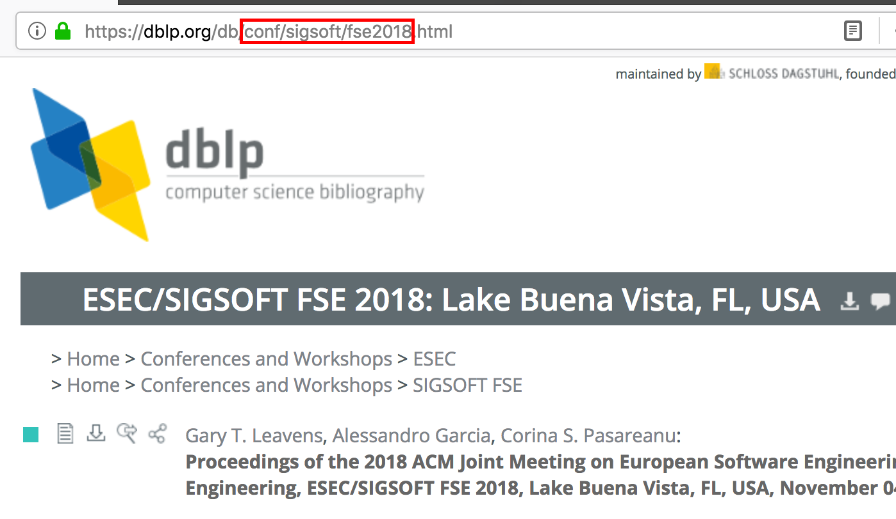

# dblp-retriever

Retrieve paper metadata from conference proceedings and journals indexed in DBLP.
Currently, retrieval of the following properties is supported:

* paper title
* authors
* heading (corresponds to journal issue or conference session name)
* page range
* paper length
* link to electronic edition of paper

The tool validates the page ranges and adds a log message to column `comment` in case possible inconsistencies are detected.
Tested with ICSE, FSE, TSE, and TOSEM 2014-2018.

# Setup

Python 3 is required. The dependencies are specified in `requirements.txt`.
To install those dependencies execute:

    pip3 install -r requirements.txt

**Optional:** Setup virtual environment with [pyenv](https://github.com/pyenv/pyenv) 
and [virtualenv](https://github.com/pyenv/pyenv-virtualenv) before executing the above command:

    pyenv install 3.7.2
    pyenv virtualenv 3.7.2 dblp-retriever_3.7.2
    pyenv activate dblp-retriever_3.7.2
    
    pip3 install --upgrade pip

# Usage

Basic usage:

    python3 dblp-retriever.py -i <path_to_input_file> -o <path_to_output_dir>

Call without parameters to get information about possible parameters:

    python3 dblp-retriever.py
    
    usage: dblp-retriever.py [-h] -i INPUT_FILE -o OUTPUT_DIR [-d DELIMITER]
    dblp-retriever.py: error: the following arguments are required: -i/--input-file, -o/--output-dir

# Configuration

As input, the tool expects a CSV file with the following three columns: `venue`, `year`, and `identifier`.
Column `venue` is a custom name for the conference or journal, `year` should be self-explanatory, and `identifier` is the DBLP identifier of a particular journal volume or conference proceeding. 

This identifier can be extracted from the DBLP-URL as follows.
In this example, we extract `conf/sigsoft/fse2018` as the identifier of the ESEC/FSE 2018 proceedings:

An exemplary input file can be found [here](input/venues.csv):

| venue | year | identifier           |
|-------|------|----------------------|
| ICSE  | 2014 | conf/icse/icse2014   |
| ...   | ...  | ...                  |
| FSE   | 2018 | conf/sigsoft/fse2018 |
| ...   | ...  | ...                  |
| TSE   | 2018 | journals/tse/tse44   |
| ...   | ...  | ...                  |

To retrieve the paper metadata for the configured venues, you just need to run the following command:

    python3 dblp-retriever.py -i input/venues.csv -o output/

The tool logs the retrieval process:

    2019-01-22 10:53:02,584 dblp-retriever_logger INFO: Reading venues from input/venues.csv...
    2019-01-22 10:53:02,588 dblp-retriever_logger INFO: 20 venues have been imported.
    2019-01-22 10:53:02,847 dblp-retriever_logger INFO: Successfully retrieved TOC of venue: conf/icse/icse2014
    2019-01-22 10:53:02,977 dblp-retriever_logger INFO: Successfully parsed TOC of venue: conf/icse/icse2014
    2019-01-22 10:53:03,121 dblp-retriever_logger INFO: Successfully retrieved TOC of venue: conf/icse/icse2015-1
    ...
    2019-01-22 10:53:07,530 dblp-retriever_logger INFO: Successfully parsed TOC of venue: journals/tosem/tosem27
    2019-01-22 10:53:07,532 dblp-retriever_logger INFO: Exporting papers to output/venues.csv...
    2019-01-22 10:53:07,548 dblp-retriever_logger INFO: 1564 papers have been exported.

And writes the [retrieved data](output/venues.csv) to the configured output directory:

| venue | year | identifier             | heading                              | title                                                                                                              | authors                                                                        | pages      | length | electronic_edition                         |
|-------|------|------------------------|--------------------------------------|--------------------------------------------------------------------------------------------------------------------|--------------------------------------------------------------------------------|------------|--------|--------------------------------------------|
| ICSE  | 2014 | conf/icse/icse2014     | Perspectives on Software Engineering | Cowboys, ankle sprains, and keepers of quality: how is video game development different from software development? | Emerson R. Murphy-Hill; Thomas Zimmermann; Nachiappan Nagappan                 | 1-11       | 11     | https://doi.org/10.1145/2568225.2568226    |
| …     | …    | …                      | …                                    | …                                                                                                                  | …                                                                              | …          | …      | …                                          |
| ICSE  | 2014 | conf/icse/icse2014     | Modeling                             | TradeMaker: automated dynamic analysis of synthesized tradespaces.                                                 | Hamid Bagheri; Chong Tang; Kevin J. Sullivan                                   | 106-116    | 11     | https://doi.org/10.1145/2568225.2568291    |
| …     | …    | …                      | …                                    | …                                                                                                                  | …                                                                              | …          | …      | …                                          |
| TOSEM | 2018 | journals/tosem/tosem27 | Volume 27, Number 4, November 2018   | Variability-Aware Static Analysis at Scale: An Empirical Study.                                                    | Alexander von Rhein; Jörg Liebig; Andreas Janker; Christian Kästner; Sven Apel | 18:1-18:33 | 33     | https://dl.acm.org/citation.cfm?id=3280986 |
